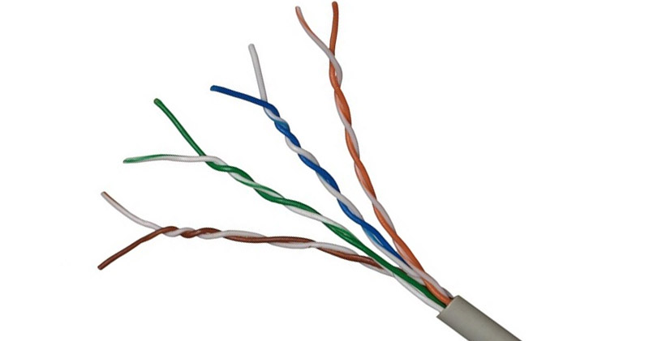
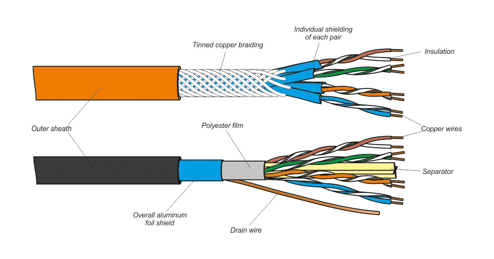
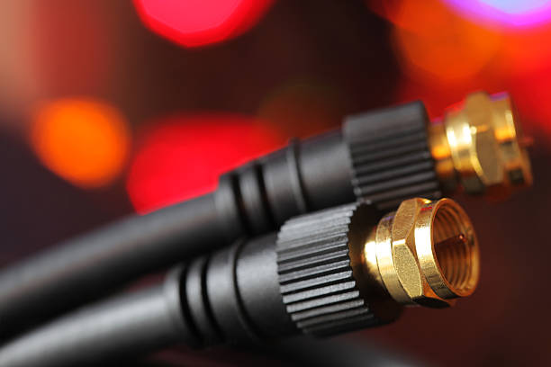
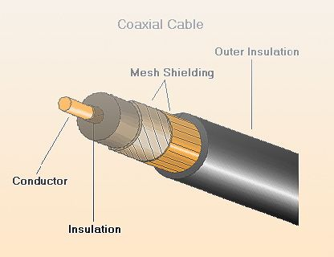
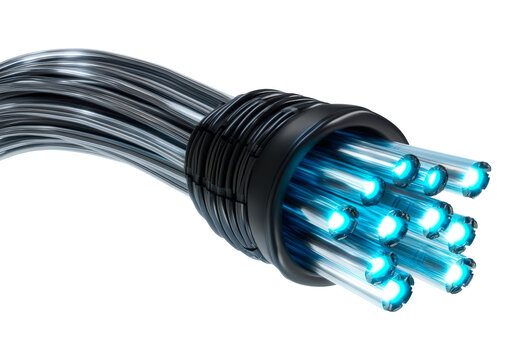

# 🔌 Lab 2: Network Media Breakdown
## 🖼️ Visuals

### Twisted Pair
Real-world example:

Diagram:

---

### Coaxial Cable
Real-world example:

Diagram:

---

### Fiber Optic Cable
Real-world example:

Diagram:

## 📍 Objective

To explore and compare common network media types based on real-world usage, cable structure, and performance. This lab aligns with **Module 6** of the Cisco Networking course.

## 🧰 Tools Used

- Cisco Packet Tracer _(optional use)_
- Google Images _(for visual references of cable types and connectors)_
- Markdown _(for formatting and documentation)_

## 📡 Network Media Types

There are three major categories of physical network media:

| **Media Type**    | **Description**                          | **Speed Range**      | **Cost** | **Common Use Cases**                         |
| ----------------- | ---------------------------------------- | -------------------- | -------- | -------------------------------------------- |
| **Twisted Pair**  | Copper wires twisted to reduce noise     | 10 Mbps – 10 Gbps    | Low      | LANs, home and office Ethernet               |
| **Coaxial Cable** | Single copper core with thick insulation | 10 Mbps – 1 Gbps     | Medium   | Cable TV, legacy broadband                   |
| **Fiber Optic**   | Glass strands that transmit light        | 100 Mbps – 100+ Gbps | High     | Backbone connections, ISPs, long-range links |

## 🧪 Optional Practical

If Packet Tracer is available, students can simulate simple wired networks using Ethernet cables to observe physical layer behavior.

---

## 🧠 Reflection

This lab clarified the advantages and limitations of different media types. I now understand how cable choice impacts speed, interference, and cost — and how to select based on physical environment and network needs.

In future labs, I’ll try to test real patch cables in my home and document signal quality, cable labeling, and connector types for hands-on comparison.

---
